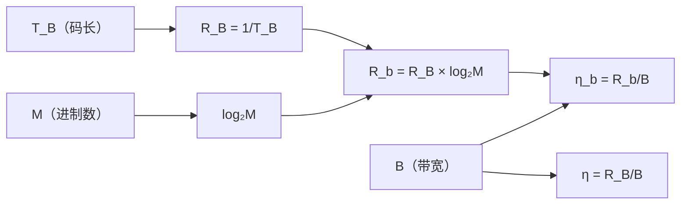

# 绪论

> [!abstract] 通信系统定义
> 实现通信（**信息传递**）过程中所需的一切技术设备的总体。

---

## 一、通信系统的分类

| 分类方式 | 类型 |
|:---|:---|
| **按信道信号特征** | 模拟通信系统 / 数字通信系统 |
| **按传输媒质** | 有线通信 / 无线通信 |
| **按传输方式** | 单工 / 半双工 / 全双工 &nbsp;&nbsp;\|&nbsp;&nbsp; 串行 / 并行 |
| **按通信业务** | 电话 / 数据 / 图像 / 多媒体 |
| **按工作波段** | 长波 / 中波 / 短波 / 微波 / 光波 |

---

## 二、信息的度量

### 1. 自信息量

信息量描述**不确定性**的大小：概率越小，信息量越大。

> [!info] 自信息量公式
> $$I(x_i) = \log_2 \frac{1}{P(x_i)} = -\log_2 P(x_i) \quad (\text{bit})$$

- $I$ 与 $P(x_i)$ 满足**对数关系**
- 单位：**bit**（比特）

### 2. 等概情况

> [!tip] 等概时的信息量
> - 二进制每个码元含 **$1$ bit**
> - $M$ 进制每个码元含 **$\log_2 M$ bit**
> - 等概时熵最大：$H = \log_2 M \ (\text{bit/symbol})$

### 3. 信息熵

> [!info] 信息熵（平均信息量）
> $$H(x) = -\sum_{i=1}^{M} P(x_i) \log_2 P(x_i) \quad (\text{bit/symbol})$$

- 单位：**bit/symbol**（比特/符号）
- 描述**信源的平均不确定度**
- 等概时熵最大
- **应用**：计算总信息量 $I = n \cdot H \ (\text{bit})$

---

## 三、性能指标

### 1. 有效性指标

| 指标 | 定义 | 公式 |
|:---|:---|:---|
| **波特率** $R_B$ | 每秒传送的**码元**个数 | $R_B = \dfrac{1}{T_B} \ (\text{Baud})$ |
| **信息速率** $R_b$ | 每秒传送的 **bit** 数 | $R_b = R_B \cdot \log_2 M \ (\text{bit/s})$ |
| **频带利用率** $\eta$ | 单位带宽内的码元速率 | $\eta = \dfrac{R_B}{B} \ (\text{Baud/Hz})$ |
| **信息频带利用率** $\eta_b$ | 单位带宽内的信息速率 | $\eta_b = \dfrac{R_b}{B} \ (\text{bit/s/Hz})$ |

### 2. 可靠性指标

| 指标 | 定义 | 公式 |
|:---|:---|:---|
| **误码率** $P_e$ | 错误码元数 / 总码元数 | $P_e = \dfrac{N_e}{N}$ |
| **误信率** $P_b$ | 错误 bit 数 / 总 bit 数 | $P_b = \dfrac{N_b}{N}$ |

> [!warning] 二进制下的关系
> $$P_e = P_b$$
> 即误码率 = 误信率

---

## 四、有效性指标关系图

> [!question] 思考题
> $R_B$ 与哪些参数有关？
> - 与**进制数 $M$** 有关（通过 $R_b$ 间接关联）
> - 与**信源统计特性**有关

---

## 五、例题

> [!example] 四进制通信系统
> 某数字通信系统采用**四进制**传输，码元速率 $R_B = 1200 \, \text{Baud}$，信道带宽 $B = 600 \, \text{Hz}$。假设各码元等概出现，求：
>
> 1. 每个码元所含的信息量
> 2. 信息传输速率 $R_b$
> 3. 频带利用率 $\eta$ 和 $\eta_b$

### 解答

**① 每个码元的信息量**

由于四进制等概，$M = 4$，每个码元的信息量为：
$$I = \log_2 M = \log_2 4 = 2 \, \text{bit}$$

**② 信息传输速率 $R_b$**

$$R_b = R_B \cdot \log_2 M = 1200 \times 2 = 2400 \, \text{bit/s}$$

**③ 频带利用率**

$$ \begin{aligned}
\eta &= \frac{R_B}{B} = \frac{1200}{600} = 2 \, \text{Baud/Hz} \\[6pt]
\eta_b &= \frac{R_b}{B} = \frac{2400}{600} = 4 \, \text{bit/s/Hz}
\end{aligned} $$

---
