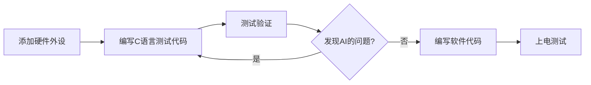

---
tags:
  - AI协作
  - 方法论
  - 工作流
---

# AI（Claude）使用指南 — 高效协作方法论

## 🎯 背景

在编写 FPGA 作为 CPU 的代码过程中，逐渐发现：对于一个复杂项目的实现，往往要经过**一步步多轮对话 + 人工审批**，才能达到理想的效果。

---

## ⚠️ 常见误区

### 误区一：图省事，直接丢需求

> ❌ 不可直接将项目要求丢给 AI，让它自我思考。

这种做法看似省事，实则**反而增大人工审核成本**。AI 在没有清晰上下文的情况下，容易沿着默认逻辑走偏。

### 误区二：AI 不会主动追问

对于不清楚的项目设计，或者需要对比询问的项目逻辑，AI **不会主动询问**，而是随意按照默认逻辑去写。

> 💡 对比人类员工：一个合格的程序员会需要清晰的项目文档，对于文档中没有包含的内容也会主动向他人询问。

**结论**：需要人为地把项目拆解、讲清约束，AI 才能产出高质量结果。

---

## ✅ 推荐工作流（硬件项目）

### 迭代式开发流程



### 关键要点

| 阶段 | 说明 |
|------|------|
| **① 硬件外设** | 先确保硬件层正确，再往上搭软件 |
| **② 测试代码** | 用 C 语言单独测试每个外设，验证 AI 生成的逻辑 |
| **③ 问题发现** | 测试后人工 review，发现问题后回退到②修复 |
| **④ 软件层** | 硬件验证通过后再编写业务软件 |
| **⑤ 上电测试** | 整机验证 |

---

## 🧠 核心沟通原则

| 原则 | 含义与应用场景 |
|------|---------------|
| **渐进式** | 从简单到复杂，模块到系统，逐步构建 |
| **可视化** | 代码 + 文字 + 图表多模态沟通，善用 ````mermaid```` 绘图 |
| **交互式** | 鼓励 AI 主动提问，验证每一小步再继续 |
| **实用性** | 要求 AI 提供可运行的示例代码，而非理论描述 |
| **批判性** | 让 AI 指出潜在问题并给出改进建议 |
| **结构化** | 层次清晰、便于检索的 prompt 结构 |
| **关联性** | 将新旧知识连接成网，利用 `[[相关笔记]]` 建立上下文 |

> 🎯 这套方法不仅适用于技术教学 / AI 协作，也适用于**任何需要解释复杂系统**的场景（产品文档、技术方案、团队培训等）。

---

## 📎 相关笔记

- [[通信专业相关/FPGA相关学习/FPGA项目实战/FPGA项目实战笔记 Mian]]
- [[06-生产赋能/prompt工程]]
