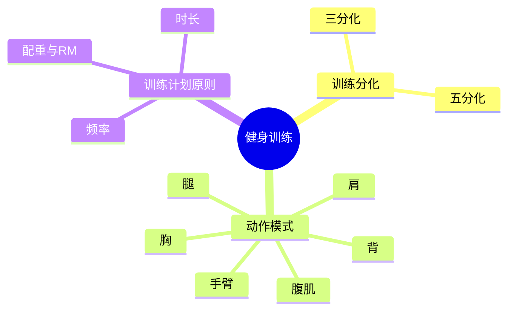

---
tags:
  - 健身
  - 训练
  - 索引
aliases:
  - 健身训练
  - 训练知识库
created: 2026-04-26
updated: 2026-07-09
---

# 🏋️ 健身训练

> 健身训练知识体系总索引。点击下方笔记深入各主题。

---

## 📂 知识结构



---

## 📑 子笔记

### 1. [[10-健身/训练分化|训练分化]]

如何将肌群分配到每周训练日中：

- **五分化**：每天一部位，适合高阶
- **三分化**：推/拉/腿循环，适合中阶

### 2. [[10-健身/动作模式|动作模式]]

按肌群分类的训练动作与关节运动：

- 胸（推胸、夹胸）、背（划船、下拉）
- 肩（前束/中束/后束）
- 肱三头、肱二头
- 腿（股四头、腘绳肌、臀）、腹肌

### 3. [[10-健身/训练计划原则|训练计划原则]]

训练设计的核心参数：

- **频率**：每周 3–5 次
- **时长**：每次 1–1.5 h / 20+ 组
- **RM 配重**：力量 1–5RM / 增肌 6–12RM / 耐力 15RM+

---

## 🧭 其他健身相关

- [[10-健身/健身饮食|健身饮食]] — 热量设计与体重控制

---

## 📊 Dataview：该目录下的所有笔记

```dataview
TABLE
  file.mtime as "上次修改"
FROM "10-健身"
SORT file.name ASC
```
