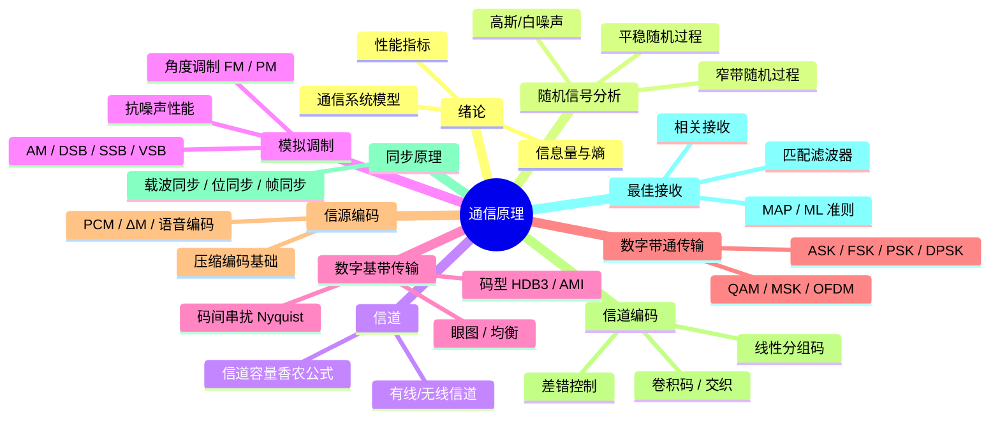

# 📡 通信原理 · 学习计划总览

> [!quote] 通信的本质是信息的有效可靠传输 — Shannon

---

## 🎯 学习目标

| 层级 | 目标 | 截止 |
|:---|:---|:---:|
| 🏁 **最终目标** | 掌握通信系统核心原理，能推导关键公式、分析系统性能 | 小学期结束 |
| 📌 **阶段一** | 完成随机过程 + 模拟调制，扎实数学基础 | 第 1-3 周 |
| 📌 **阶段二** | 数字基带/带通传输系统 + 最佳接收 | 第 4-7 周 |
| 📌 **阶段三** | 信源/信道编码 + 同步 + 综合复习 | 第 8-10 周 |

---

## 📚 课程知识体系

---

## 🗺️ 学习资源快速入口

| 资源 | 说明 | 链接 |
|:---|:---|:---|
| [[通信原理/网课资源\|🎬 网课资源清单]] | B站/MOOC 推荐课程 | → |
| [[通信原理/学习进度追踪\|📊 进度追踪表]] | Dataview 学习进度 | → |
| [[通信原理/学习时间规划\|⏰ 时间规划表]] | 每周详细时间安排 | → |

---

## 📋 周计划概览

| 周次 | 日期 | 核心内容 |
|:---:|:---|:---|
| 第 1 周 | 7/6 — 7/12 | 绪论、信号与系统基础回顾、随机过程基础 |
| 第 2 周 | 7/13 — 7/19 | 随机过程续、信道特性与香农公式 |
| 第 3 周 | 7/20 — 7/26 | **模拟调制**（线性调制 AM/DSB/SSB） |
| 第 4 周 | 7/27 — 8/2 | 模拟调制续（FM/PM）、**数字基带传输**（码型、Nyquist） |
| 第 5 周 | 8/3 — 8/9 | **数字带通传输**（ASK/FSK/PSK/DPSK） |
| 第 6 周 | 8/10 — 8/16 | 数字调制续（QAM/MSK/OFDM 概述）、**最佳接收** |
| 第 7 周 | 8/17 — 8/23 | **信源编码**（PCM、ΔM） |
| 第 8 周 | 8/24 — 8/30 | **信道编码**（线性分组码、卷积码） |
| 第 9 周 | 8/31 — 9/6 | 同步原理、综合串讲 |
| 第 10 周 | 9/7 — 9/13 | **总复习 + 查漏补缺** |

> [!tip] 学习节奏建议
> - **每节正课** → 当天整理笔记 + 做课后习题
> - **每周末** → 回顾本周进度，更新 [[学习进度追踪]]
> - **每个大章节结束** → 画一张思维导图（Excalidraw 或 Mermaid）

---

## 📖 笔记目录

- [[通信原理/笔记/|📂 笔记文件夹]] — 每章节独立笔记
- [[通信原理/习题/|📂 习题文件夹]] — 课后习题与错题

---

*计划创建时间：2026-07-03*
